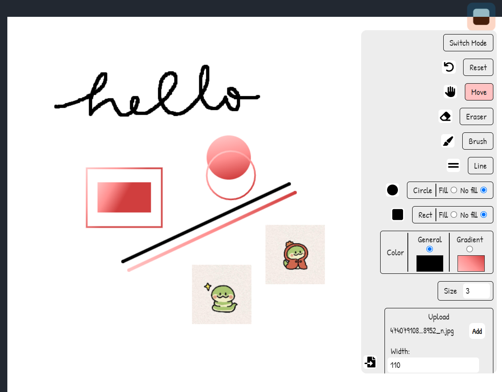

<h1 align="center">Brusha</h1>
<p align="center" style="font-size:16px"><strong>A free, lightweight and blazing fast drawing app</strong></p>
<p align="center">  
  
</p>

<p align="center">
  
  
  
  
</p>

<div align="center"><a href="https://yuran1811.github.io/Brusha/" target="_blank">Live Demo</a></div>

## Features

- [x] Infinite workspace (can be modified)
- [x] Draw freestyle
- [x] Draw lines
- [x] Draw circles
- [x] Draw rectangles (fill | nofill)
- [x] Draw images
- [x] Theme toggle
- [x] Change brush size
- [x] Change brush color
- [x] Reset & Resize the workspace
- [x] Undo & Redo draw

## Tech Stack


## Screenshots



## Quick Start

Follow these steps to set up the project locally on your machine.

**Prerequisites**

Make sure you have the following installed on your machine:

- [Git](https://git-scm.com/)
- [Node.js](https://nodejs.org/en)
- [npm](https://www.npmjs.com/) (Node Package Manager)

**Cloning the Repository**

```bash
git clone https://github.com/yuran1811/Brusha.git
cd Brusha
```

**Installation**

Install the project dependencies:

```bash
npm install
```

or

```bash
yarn
```

**Running the Project**

```bash
npm run dev
```

or

```bash
yarn dev
```

Open [http://localhost:5173](http://localhost:5173) in your browser to view the project.
